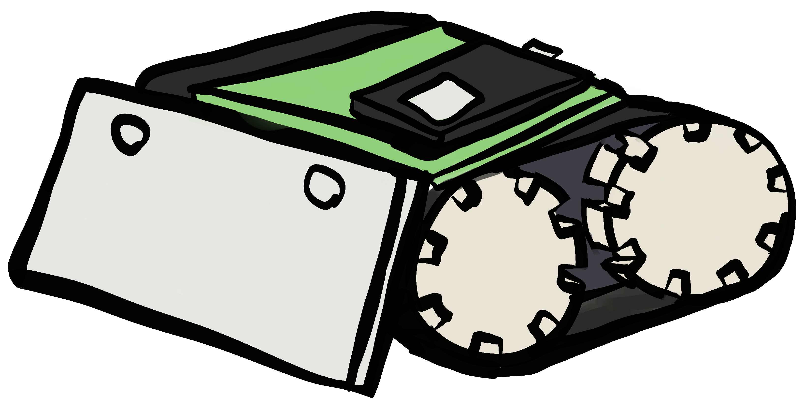

# Oppstartsuka BIELDIG og BIAIS 2024
Repo for oppstartsuka til BIELDIG og BIAIS i 2024. Her finner du alle filene du vil trenge for det faglige opplegget. Last gjerne ned hele repo-et som en .zip fil ved å trykke på den grønne knappen "<> Code".

<br>
<br>
<p align="center">
  
</p>


QR-kode for lerret-visning:
<br>
<br>
<p align="center">
  
</p>

# Car-library guide for the ESP32/Zumo

### Setup

The `carLibrary` exposes a class named `Car`. Its constructor accepts a network name and password.

```cpp
Car car("networkName", "networkPassword");
```

In the program setup call the member function `initCar`.

```cpp
void setup() {
   car.initCar();
}
```

### Buttons and driving

The `carLibrary` exposes three void functions named `triangle`, `circle` and `square`. These are called when the corresponding buttons on the control panel are pressed, and released. They all accept a parameter `bool button` indicating whether the button is pressed down or released. The defined helpers `UP` and `DOWN` can be used to check the button direction.

```cpp
void triangle(bool button) {
  if (button == UP) {
      // button is released
   }
  if (button == DOWN) {
      // button is pressed
   }
}
```

To drive the car use the member function `drive`. This takes two arguments representing the speed of the left and right belt. These arguments are integers ranging from `-100` to `100`.

```cpp
// drive forward max speed
car.drive(100,100);

// stop car
car.drive(0,0);

// sharp turn left at half speed
car.drive(-50, 50);
```

> Driving with low speeds can be harmful to the motors. A `MOTOR_LOWER_LIMIT` has therefor been placed at _30_. Trying to drive with speeds under this limit will result in the car stopping.

### Sensor data

Sensor data can be fetched through the `data` array on the _Car_ class. Each data point contains a `value` and `flag`. All data values are integers and are updated roughly **20 times per second**. Whenever a data value is updated the data flag is set to true.

```cpp
// reading data continously
int proxData = car.data[PROXIMITY].value;

// read data when it is available
if (car.data[PROXIMITY].flag) {
   int proxData = car.data[PROXIMITY].value;
   car.data[PROXIMITY].flag = false;
}
```

The available data can be fetched using the defined helpers.
| Data | Range | Details |
|----- | :-----: | ----- |
| PROXIMITY | 0 &rarr; 12 | The closer the object the higher the value. |
| LINE | -100 &rarr; 100 | When the line is to the right of the car the number is positive. |
| ENCODERS | **n/a** | Encoder counts 12 times per motor rotation. |
| READ_TIME | **n/a** | Time corresponding to one encoder reading in _ms_. |
| GYRO | -180 &rarr; 180 | Car angle along the _z_ axis. |

> **_Motor rotations:_** Because of the 75:1 gear ratio in the motor every 75th motor rotation corresponds to one rotation of the wheel.

**Calibrating**

-  To calibrate the gyroscope use the member function `calibrateGyro`. This accepts an unsigned integer indicating the precision of the calibration. This value may typically be in the range of _1024_ to _4096_, although a higher number leads to better precision. **The car must be completely still when calibrating**. The buzzer will sound when calibration is done.

```cpp
// calibrate gyro with 2048 as precision
car.calibrateGyro(2048);
```

-  To calibrate the line sensors use the member function `calibrateLine`. This accepts a helper `BLACK` or `WHITE` indicating whether the car should read a dark line on a light background or the opposite. **The car must be placed on a line when calibrating**. The buzzer will sound when calibration is done.

```cpp
// follow dark line
car.calibrateLine(BLACK);
```

### Graphing data

The control panel can graph three seperate data streams. The member function `sendData` accepts two arguments; an int specifying the graph and the data to send.

```cpp
// send gyroscope data to graph 1
car.sendData(1, car.data[GYRO].value);

// send variable speed to graph 3
car.sendData(3, speed);
```

To send continous data call the function in the program loop. The function will update the graph data roughly **10 times per second**.
